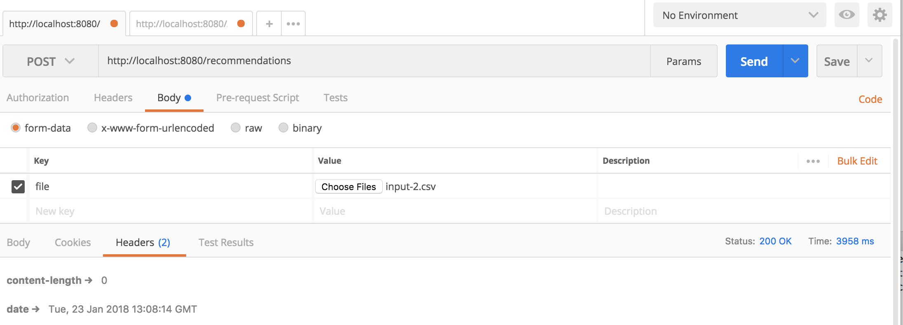
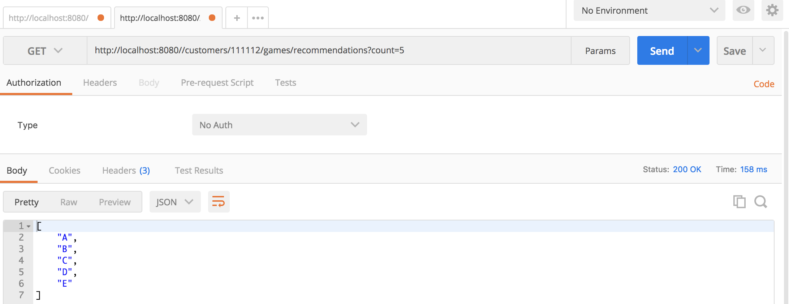

#Recommendation Microservice
This service offers product/game recommendations for a given user.

# Api Description

    GET  /customers/{userid}/games/recommendations?count={count}
    
* **Description** 
  * fetches `{count}` number of recommendations for `{userid}`
* **Success Response:**

  * **Code:** 200  
    **Content:** `[ "ProductA", "ProductB", "ProductC", "ProductD", "ProductE"]`
 
* **Error Response:**

  * **Code:** 404 NOT FOUND  
    **Content:** `{ error : 'No recommednation found for {customerNumber} }`
    

    POST /recommendations
* **Description** 
  * imports an csv uploaded as `file` 
  * csv file has a header with the following structure
     * `"customerNumber", "recommendationActive", "rec1", "rec2", "rec3", "rec4", "rec5", "rec6", "rec7", "rec8", "rec9", "rec10"` 
* **Success Response:**

  * **Code:** 200  
 
* **Error Response:**

  * **Code:** 404 NOT FOUND  
    **Content:** `{ error : '{exception.message}`
       
#Developers Guide
* **Assumptions:**
  * docker is installed locally
  * a postgres database must be available somewhere (e.g. local, remote, another docker container)
  
* To start the server local execute
  * set your postgres database url as system env `DATABASE_URL=postgres://{USERNAME}:{PASSWORD}@{HOST}`
  * `mvn package && java -jar target/tollwood-recomm-0.0.1.jar`  
  
* To build and run docker image execute
  * `mvn install dockerfile:build`
  * `docker run -p 8080:8080 -t -e DATABASE_URL=postgres://{USERNAME}:{PASSWORD}@{HOST} tollwood/tollwood-recomm`

#Live Demo
The Service is hosted on heroku: [link_with_recommendations](https://tollwood-recomm.herokuapp.com/customers/111112/games/recommendations?count=5)
Follow the screenshots below to see how to configure postman

#Screenshots

